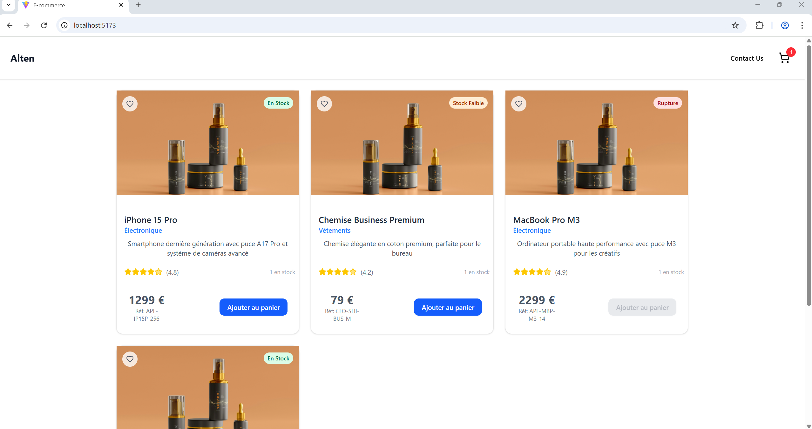
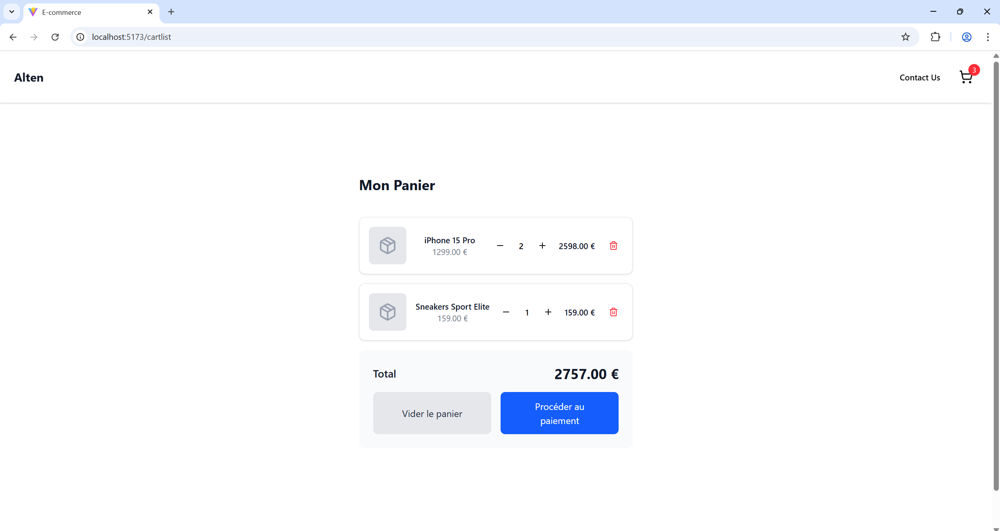
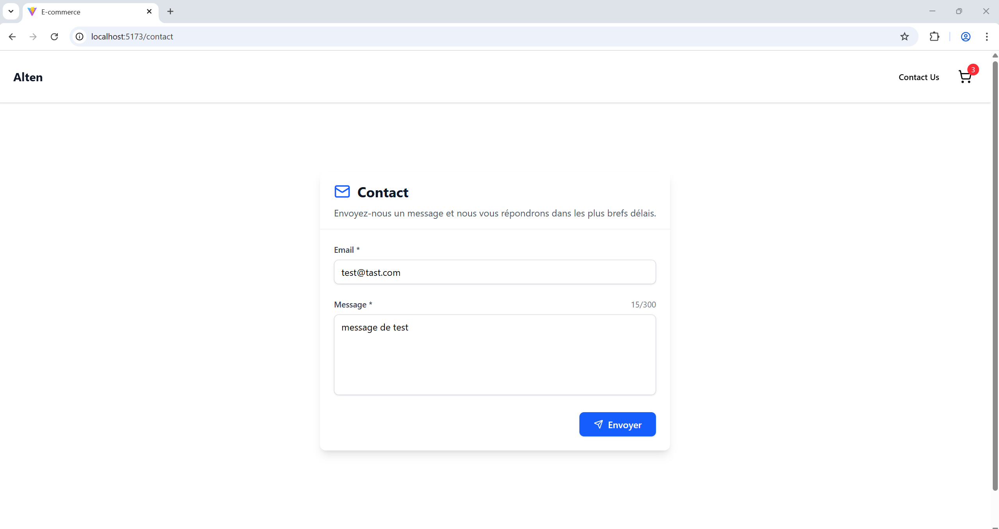
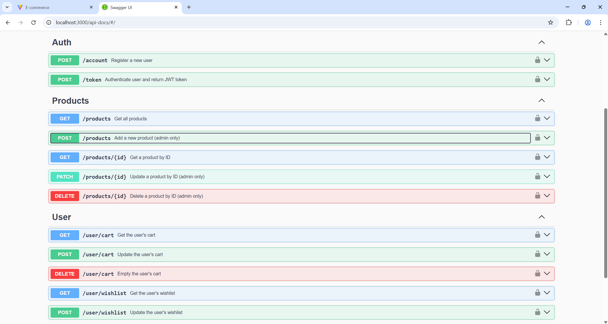

# Product Trial App

This is a full-stack e-commerce trial application that allows users to browse products, view details, and interact with wishlists and shopping carts. It also features secure access using token-based authentication and comprehensive API documentation via Swagger.

## Snapshots

### App UI




### Swagger Documentation


🔗 Swagger Link: [http://localhost:3000/api-docs/#/](http://localhost:3000/api-docs/#/)

## Getting Started

### 1. Clone the Repository

```bash
git clone https://github.com/BoujaafarWidad/product-trial.git
cd product-trial-master
```
### 2. Backend Setup

```bash
cd backend
npm install
npm run dev
```
- Server runs at: http://localhost:3000
- Swagger docs available at: http://localhost:3000/api-docs/#/

### 3. Frontend Setup

```bash
cd front-react
npm install
npm run dev
```
- Frontend runs at: http://localhost:5173/

## 🔑 Important: Token Authentication Setup

This app uses a **Token** to access protected routes like **products** and other **user-specific features**.

> ⚠️ **Note:** The token **expires periodically** and must be **manually updated** since I didn't implement the auth interface.

### To run the app properly:

1. **Generate a valid token** using your backend login endpoint or via **Swagger UI**.
2. **Locate the `App.tsx` file** inside: front-react/src/App.tsx

## Running Tests

This project includes tests for both the **frontend (React)** and **backend (Node.js / Express or NestJS)**. Below are the instructions for running them.

---

### 🧪 Frontend Tests (React)

We use **Jest** and **React Testing Library** for frontend testing.

#### To run frontend tests:

Navigate to the `front-react/` directory:

   ```bash
   cd front-react
   npx test
   ```

#### To run backend tests:   

Navigate to the `front-react/` directory:

   ```bash
   cd back
   npx test
   ```

# Consignes

- Vous êtes développeur front-end : vous devez réaliser les consignes décrites dans le chapitre [Front-end](#Front-end)

- Vous êtes développeur back-end : vous devez réaliser les consignes décrites dans le chapitre [Back-end](#Back-end) (*)

- Vous êtes développeur full-stack : vous devez réaliser les consignes décrites dans le chapitre [Front-end](#Front-end) et le chapitre [Back-end](#Back-end) (*)

(*) Afin de tester votre API, veuillez proposer une stratégie de test appropriée.

## Front-end

Le site de e-commerce d'Alten a besoin de s'enrichir de nouvelles fonctionnalités.

### Partie 1 : Shop

- Afficher toutes les informations pertinentes d'un produit sur la liste
- Permettre d'ajouter un produit au panier depuis la liste 
- Permettre de supprimer un produit du panier
- Afficher un badge indiquant la quantité de produits dans le panier
- Permettre de visualiser la liste des produits qui composent le panier.

### Partie 2

- Créer un nouveau point de menu dans la barre latérale ("Contact")
- Créer une page "Contact" affichant un formulaire
- Le formulaire doit permettre de saisir son email, un message et de cliquer sur "Envoyer"
- Email et message doivent être obligatoirement remplis, message doit être inférieur à 300 caractères.
- Quand le message a été envoyé, afficher un message à l'utilisateur : "Demande de contact envoyée avec succès".

### Bonus : 

- Ajouter un système de pagination et/ou de filtrage sur la liste des produits
- On doit pouvoir visualiser et ajuster la quantité des produits depuis la liste et depuis le panier 

## Back-end

### Partie 1

Développer un back-end permettant la gestion de produits définis plus bas.
Vous pouvez utiliser la technologie de votre choix parmi la liste suivante :

- Node.js/Express
- Java/Spring Boot
- C#/.net Core
- PHP/Symphony : Utilisation d'API Platform interdite


Le back-end doit gérer les API suivantes : 

| Resource           | POST                  | GET                            | PATCH                                    | PUT | DELETE           |
| ------------------ | --------------------- | ------------------------------ | ---------------------------------------- | --- | ---------------- |
| **/products**      | Create a new product  | Retrieve all products          | X                                        | X   |     X            |
| **/products/:id**  | X                     | Retrieve details for product 1 | Update details of product 1 if it exists | X   | Remove product 1 |

Un produit a les caractéristiques suivantes : 

``` typescript
class Product {
  id: number;
  code: string;
  name: string;
  description: string;
  image: string;
  category: string;
  price: number;
  quantity: number;
  internalReference: string;
  shellId: number;
  inventoryStatus: "INSTOCK" | "LOWSTOCK" | "OUTOFSTOCK";
  rating: number;
  createdAt: number;
  updatedAt: number;
}
```

Le back-end créé doit pouvoir gérer les produits dans une base de données SQL/NoSQL ou dans un fichier json.

### Partie 2

- Imposer à l'utilisateur de se connecter pour accéder à l'API.
  La connexion doit être gérée en utilisant un token JWT.  
  Deux routes devront être créées :
  * [POST] /account -> Permet de créer un nouveau compte pour un utilisateur avec les informations fournies par la requête.   
    Payload attendu : 
    ```
    {
      username: string,
      firstname: string,
      email: string,
      password: string
    }
    ```
  * [POST] /token -> Permet de se connecter à l'application.  
    Payload attendu :  
    ```
    {
      email: string,
      password: string
    }
    ```
    Une vérification devra être effectuée parmi tout les utilisateurs de l'application afin de connecter celui qui correspond aux infos fournies. Un token JWT sera renvoyé en retour de la reqûete.
- Faire en sorte que seul l'utilisateur ayant le mail "admin@admin.com" puisse ajouter, modifier ou supprimer des produits. Une solution simple et générique devra être utilisée. Il n'est pas nécessaire de mettre en place une gestion des accès basée sur les rôles.
- Ajouter la possibilité pour un utilisateur de gérer un panier d'achat pouvant contenir des produits.
- Ajouter la possibilité pour un utilisateur de gérer une liste d'envie pouvant contenir des produits.

## Bonus

Vous pouvez ajouter des tests Postman ou Swagger pour valider votre API